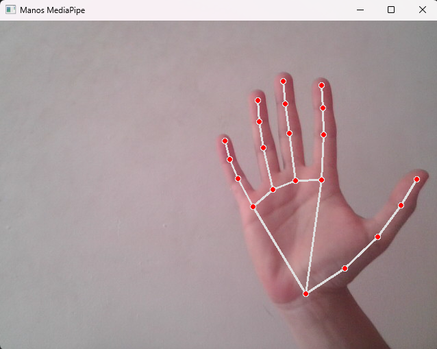

# AAII-TUIA-Alomar-Arce (Repositorio destinado a los trabajos prácticos de la materia de Aprendizaje Automático de la TUIA (UNR))
## Trabajo Práctico N°1

### Integrantes:
- Alomar Francisco
- Arce Sofía

## Ejercicio 1

Predicción del índice de rendimiento académico de estudiantes en exámenes a partir de:
- horas estudiadas
- notas anteriores
- participación en actividades curriculares.
- horas de sueño.
- cantidad de examenes de prueba realizados. 

## Ejercicio 2 - Detección de piedra, papel o tijera. 

### Creación del entorno virtual (opcional):

#### En Windows:
``` bash
python -m venv aa2_ej
aa2_ej\Scripts\activate 
pip install -r requirements.txt
```

#### En Linux: 
``` bash
python3 -m venv aa2_ej
source aa2_ej/bin/activate
pip install -r requirements.txt
```
### Instalar dependencias:

#### En Windows:
python -m pip install -r .\requirements.txt 

### Creación del dataset:
Al correr *record-dataset.py* se abrirá una ventana, donde se deberá colocar la mano con las diferentes señas (Piedra, Papel, Tijera):
<br>



<br>

En la terminal se ven las letras que se deben presionar para tomar las capturas y ya separarlas para el armado del dataset.
<br>


### Entrenamiento del modelo:

## Ejercicio 3 - Modelo de clasificación de imagenes de paisajes. 
- edificios
- bosques
- glaciares
- montañas
- mares 
- calles


