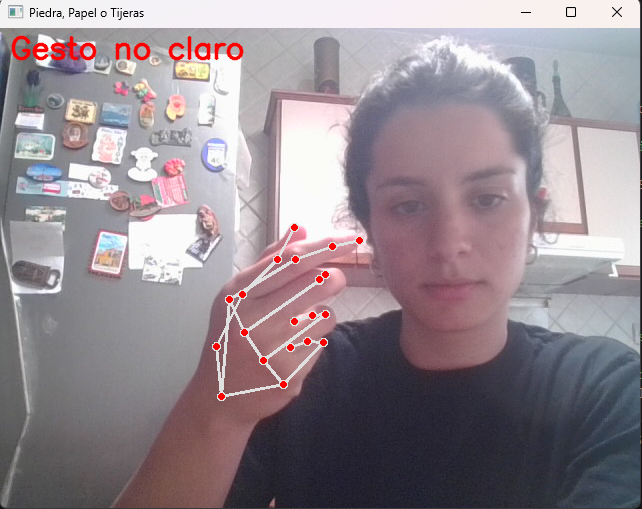
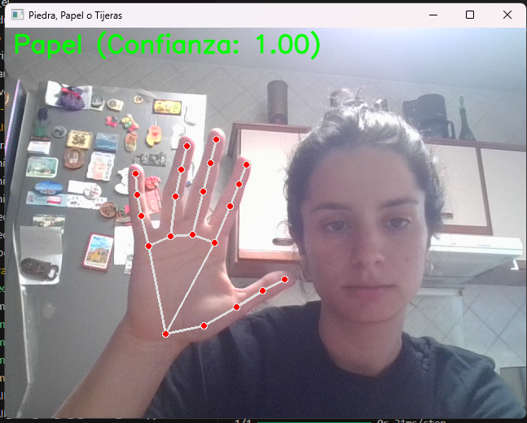

# AAII-TUIA-Alomar-Arce (Repositorio destinado a los trabajos prácticos de la materia de Aprendizaje Automático de la TUIA (UNR))
## Trabajo Práctico N°1

### Integrantes:
- Alomar Francisco
- Arce Sofía

## Ejercicio 1

Predicción del índice de rendimiento académico de estudiantes en exámenes a partir de:
- horas estudiadas
- notas anteriores
- participación en actividades curriculares.
- horas de sueño.
- cantidad de examenes de prueba realizados. 

## Ejercicio 2 - Detección de piedra, papel o tijera. 

### Creación del entorno virtual (opcional):

#### En Windows:
``` bash
python -m venv aa2_ej
aa2_ej\Scripts\activate 
pip install -r requirements.txt
```

#### En Linux: 
``` bash
python3 -m venv aa2_ej
source aa2_ej/bin/activate
pip install -r requirements.txt
```
### Instalar dependencias:

#### En Windows:
``` bash
python -m pip install -r .\requirements.txt 
```

### Creación del dataset:
Al correr *record-dataset.py* se abrirá una ventana, donde se deberá colocar la mano con las diferentes señas (Piedra, Papel, Tijera):
<br>


<br>

En la terminal se ven las letras que se deben presionar para tomar las capturas y ya separarlas para el armado del dataset.
<br>


### Entrenamiento del modelo:

Una vez cargado el dataset. Se debe entrenar el modelo, correr *train-gesture-classifier.py*.

Comenzará el entrenamiento.

<br>

Al terminar verás gráficos del entrenamiento: 


<br>

y el modelo guardado.


### Clasificación:

Para usarlo, correr *rock-paper-scissors.py*

En la terminal se verá una breve descripción del modelo.

<br>


Se abrirá la cámara y el modelo clasifica los gestos en tiempo real. 

<br>






## Ejercicio 3 - Modelo de clasificación de imagenes de paisajes. 

Comparación entre modelos con arquitecturas de capas densas vs. solamente capas convolucionales vs. bloques residuales vs. transfer learning para clasificar imagenes en las siguientes categorías: 

- edificios
- bosques
- glaciares
- montañas
- mares 
- calles


